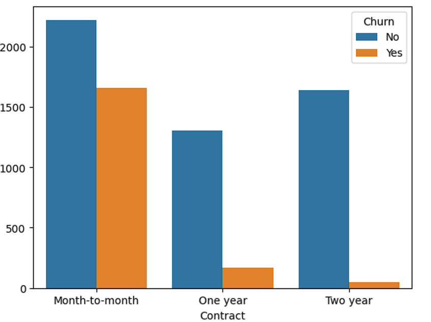
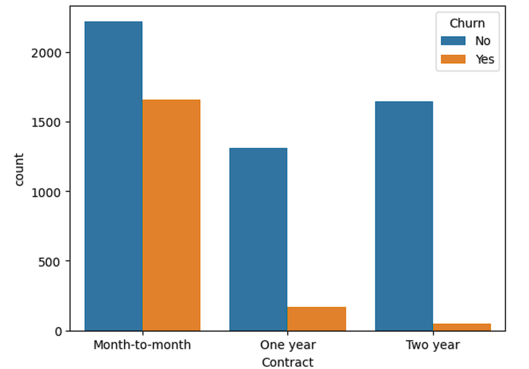
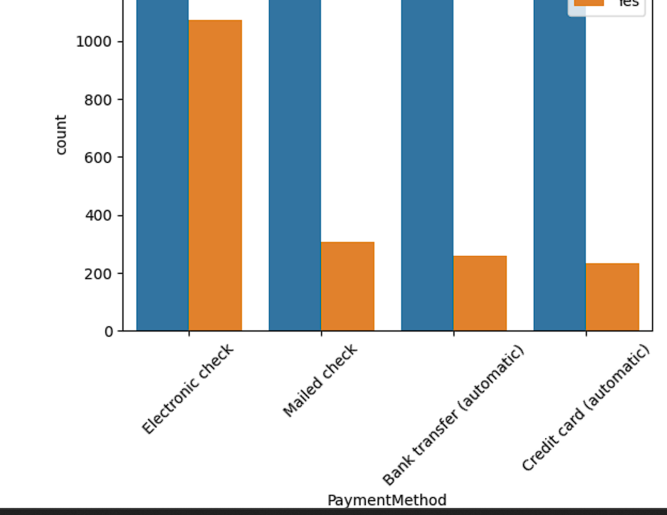

# 📊 Customer Churn Analysis & Prediction

#  Project Overview
This project analyzes customer churn behavior using a telecom dataset and builds a machine learning model to predict whether a customer will churn.

---

##  Objectives
- Understand factors influencing customer churn
- Perform exploratory data analysis (EDA)
- Build a predictive machine learning model

---

# 🛠️ Tools & Technologies
- Python
- Pandas
- NumPy
- Matplotlib & Seaborn
- Scikit-learn

---

## 📂 Dataset
Telco Customer Churn Dataset containing customer demographics, services, and billing information.

---

##🔍 Exploratory Data Analysis (EDA)

# Key Insights:
- 📉 Customers with **month-to-month contracts** churn more
- ⏳ Customers with **low tenure** are more likely to churn
- 💰 Higher **monthly charges** increase churn probability
- 💳 Customers using **electronic check** have higher churn

---

## 📊 Visualizations

### Contract Type vs Churn

### Monthly Charges vs Churn

### Payment Method vs Churn

---

##  Model Building
- Model Used: Logistic Regression
- Accuracy: **78.67%**

---

##  Model Evaluation
The model performs well in predicting customer churn with good accuracy.

---

##  Conclusion
This project helps identify customers who are likely to churn and enables businesses to take proactive actions to improve customer retention.

---

##  Future Improvements
- Try advanced models like Random Forest and XGBoost
- Hyperparameter tuning
- Deployment using Streamlit

# Business Recommendations
Offer discounts for long-term contracts
Improve onboarding for new users
Target high-risk customers with retention campaigns
---

## 👨‍💻 Author
Akash Prakashan
